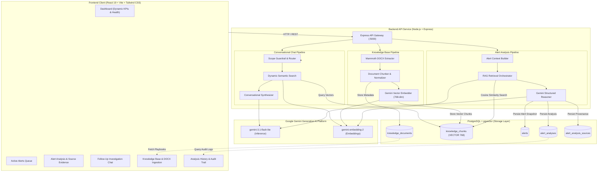

# 🛡️ AlertIQ

**AI-Powered Cybersecurity Alert Mitigation Assistant for SOC Analysts**

AlertIQ is an intelligent, retrieval-augmented decision support platform designed to accelerate incident response for Security Operations Center (SOC) teams. When security alerts are triggered, analysts often lose critical containment time manually searching through disparate repositories of incident runbooks, threat intelligence advisories, and organizational playbooks. AlertIQ bridges this gap by combining **structured alert context**, **Google Gemini generative AI**, **semantic Retrieval-Augmented Generation (RAG)**, and **PostgreSQL with pgvector** to automatically synthesize grounded, auditable, and actionable mitigation guidance with cited source evidence.

---

## 📋 Table of Contents

- [Overview](#-overview)
- [Key Features](#-key-features)
- [System Architecture](#-system-architecture)
- [End-to-End Alert Analysis Flow](#-end-to-end-alert-analysis-flow)
- [Knowledge Base & RAG Pipeline](#-knowledge-base--rag-pipeline)
- [DOCX Document Ingestion](#-docx-document-ingestion)
- [Follow-Up Investigation Chat](#-follow-up-investigation-chat)
- [AI & Google Gemini Integration](#-ai--google-gemini-integration)
- [API Reference](#-api-reference)
- [Database Architecture](#-database-architecture)
- [Project Structure](#-project-structure)
- [Technology Stack](#-technology-stack)
- [Prerequisites](#-prerequisites)
- [Environment Configuration](#-environment-configuration)
- [Installation & Setup](#-installation--setup)
- [Running the Application](#-running-the-application)
- [Knowledge Base Usage Walkthrough](#-knowledge-base-usage-walkthrough)
- [Example Demo Scenario](#-example-demo-scenario)
- [Testing & Verification](#-testing--verification)
- [Current System Boundaries](#-current-system-boundaries)
- [Security & Operational Considerations](#-security--operational-considerations)
- [Troubleshooting](#-troubleshooting)
- [Future Enhancements](#-future-enhancements)
- [License](#-license)

---

## 🎯 Overview

### The Problem in Modern SOC Operations
Security analysts face persistent challenges during threat triage:
- **Alert Fatigue & Fragmented Knowledge**: Telemetry from SIEM, EDR, and IDS tools provides raw events (IPs, processes, hashes), but remediation steps remain siloed across PDF/DOCX runbooks, wikis, and threat bulletins.
- **Manual Lookup Overhead**: Locating the correct containment steps during a critical compromise (e.g. ransomware propagation or credential theft) introduces operational latency.
- **Hallucination Risk**: Standard AI chatbots lack organizational grounding and may suggest generic, unverified, or dangerous containment actions.

### How AlertIQ Solves This
1. **Downstream Advisory Model**: AlertIQ operates downstream of alert generation. It does not replace detection tools; it empowers the analyst after an alert is raised.
2. **Deterministic Context Construction**: The alert's telemetry (severity, source IP, destination IP, target host, user, evidence) is extracted into a normalized schema.
3. **Dense Vector Search**: AlertIQ embeds the alert context into dense vector space and searches PostgreSQL using `pgvector` cosine similarity to retrieve matching organizational runbooks.
4. **Grounded AI Synthesis**: Google Gemini uses the alert context together with relevant retrieved knowledge-base content to produce grounded mitigation guidance.
5. **Auditable Decision Support**: Every recommendation displays the exact source runbooks and similarity scores. The human analyst retains final authority over all remediation actions.

```
┌────────────────────────────────────────────────────────┐
│ External SIEM / EDR / IDS (Detection Layer)           │
└──────────────────────────┬─────────────────────────────┘
                           │ Active Security Alert
                           ▼
┌────────────────────────────────────────────────────────┐
│ AlertIQ: Grounded AI Mitigation Assistant              │
│                                                        │
│  [Alert Context] + [pgvector RAG] + [Google Gemini]    │
│                           │                            │
│                           ▼                            │
│  [Grounded Mitigations] + [Cited Source Playbooks]     │
└──────────────────────────┬─────────────────────────────┘
                           │
                           ▼
┌────────────────────────────────────────────────────────┐
│ Human SOC Analyst (Reviews, Verifies & Executes)       │
└────────────────────────────────────────────────────────┘
```

---

## ✨ Key Features

- **Dynamic Threat Overview Dashboard**: Real-time KPI metrics for active threats, critical/high severity queues, persisted database audits, and indexed knowledge documents with backend pipeline health monitoring.
- **Simulated Alert Telemetry Queue**: Filterable and searchable alert queue supporting multi-attribute filtering (severity, triage status, detection source, keyword search).
- **Structured AI Mitigation Analysis**: Enforced JSON-schema generation providing:
  - Concise incident executive summary
  - Risk assessment level (`LOW`, `MEDIUM`, `HIGH`, `CRITICAL`) with contextual reasoning
  - Observed key threat indicators
  - Priority-ordered investigation steps
  - Concrete containment and remediation actions
  - Analysis assumptions and operational limitations
- **Semantic RAG Retrieval with pgvector**: 768-dimensional dense vector embeddings generated via Gemini, indexed in PostgreSQL using cosine distance (`<=>`).
- **Knowledge Base Management**:
  - Live inventory of indexed security playbooks and threat intelligence advisories
  - Ingestion of manual text runbooks with configurable chunking parameters
  - Microsoft Word (`.docx`) binary file upload and automatic text extraction
  - Semantic vector search testing tool
  - Document deletion with cascading chunk removal
- **Source Provenance & Evidence Drawer**: Inspection panel displaying cited runbook titles, categories, source origins, and similarity match percentages with full-text chunk modal preview.
- **Contextual Follow-Up Chat**:
  - Conversational investigation assistant maintaining multi-turn context
  - Dynamic RAG queries tailored to specific analyst follow-up inquiries
  - Fast-path guardrails for greetings and out-of-scope redirection
  - Zero pollution of primary alert audit history logs
  - Structured Markdown rendering for tabular data and code snippets
- **Persistent Analysis History**: Audited analysis logs stored in PostgreSQL with server-side pagination, multi-attribute filtering, and read-only historical snapshot inspection.

---

## 🏗️ System Architecture



---

## 🔄 End-to-End Alert Analysis Flow

```
1. Alert Selection
   Analyst selects an alert from the simulated queue (e.g. ALT-2026-007: Lateral Movement).

2. Analysis Trigger
   Analyst clicks "Analyze Mitigation". Frontend sends payload to POST /api/alerts/analyze.

3. Context Formatting & Validation
   Backend validates mandatory fields (title, severity, source) and normalizes telemetry 
   (source IP, destination IP, target host, user, evidence list).

4. RAG Query Formulation
   RAG orchestrator compiles a dense search query based on the alert title, threat indicators, 
   and observed behavior.

5. Vector Embedding Generation
   Backend calls Gemini Embedding API (gemini-embedding-2) to generate a 768-dimensional float vector.

6. Cosine Similarity Search
   PostgreSQL executes pgvector cosine distance:
   SELECT *, (1 - (embedding <=> $1)) AS similarity FROM knowledge_chunks WHERE ... ORDER BY similarity DESC LIMIT 5;

7. Context Assembly & Grounding
   Candidate runbook chunks exceeding the similarity threshold (default: 0.60) are compiled 
   into a structured markdown grounding context.

8. Structured AI Inference
   Google Gemini (gemini-3.1-flash-lite) evaluates the alert against the retrieved playbooks, 
   enforcing strict JSON schema output.

9. Audit Trail Persistence
   Backend saves the raw alert, normalized analysis, and RAG provenance links into PostgreSQL tables 
   (alerts, alert_analyses, alert_analysis_sources) in a single transactional flow.

10. UI Rendering & Evidence Review
    Frontend displays the risk badge, recommendations, investigation checklist, and cited source playbooks.
```

---

## 📚 Knowledge Base & RAG Pipeline

```
Raw Runbook (DOCX / Text)
        │
        ▼
Validation & Normalization (Sanitizes characters, verifies ZIP/PK signatures)
        │
        ▼
Recursive Character Chunking (Default: 800 chars, 150 chars overlap)
        │
        ▼
Dense Vector Embedding (Google Gemini gemini-embedding-2 -> 768-dim float array)
        │
        ▼
PostgreSQL Storage (knowledge_documents + knowledge_chunks with VECTOR(768))
        │
        ▼
Semantic Retrieval using PostgreSQL + pgvector cosine similarity
        │
        ▼
Grounded AI Mitigation Synthesis (Grounded in retrieved knowledge content)
```

Uploaded documents are actively parsed, chunked, and embedded into vector storage. The pre-seeded knowledge corpus contains eight source-attributed defensive documents based on guidance from CISA, NIST, OWASP, and MITRE ATT&CK:
- **CISA**: Ransomware Remediation, PowerShell Obfuscation, DNS Tunneling, Phishing Analysis
- **NIST**: SSH Brute Force Incident Handling
- **OWASP**: SQL Injection Attack Response
- **MITRE ATT&CK**: Credential Dumping (LSASS), Data Exfiltration Over Web Services

---

## 📄 DOCX Document Ingestion

The backend provides a dedicated multipart ingestion pipeline for Microsoft Word (`.docx`) files:
- **Endpoint**: `POST /api/knowledge/documents/upload`
- **File Validation**:
  - Maximum upload size: **10 MB** (enforced by Multer and application guards)
  - Supported extension: `.docx` (MIME: `application/vnd.openxmlformats-officedocument.wordprocessingml.document`)
  - Magic Byte Verification: Validates OpenXML ZIP package signatures (`0x50 0x4B`) to prevent file extension spoofing
- **Text Extraction**: Uses `mammoth` to extract clean, unformatted plain text while normalizing line breaks and whitespace.
- **Safety Checks**: Rejects corrupt, password-protected, empty, or image-only documents lacking readable text content.
- **Immediate Indexing**: Extracted text is immediately chunked, embedded via Gemini, and indexed into `pgvector` for instant retrieval across analysis and chat workflows.

---

## 💬 Follow-Up Investigation Chat

The interactive follow-up assistant allows analysts to probe deeper into active incidents:
- **Endpoint**: `POST /api/alerts/chat`
- **Scoped Context**: Each query inherits the alert's telemetry, prior conversation turns, and indexed runbook context.
- **Dynamic Search**: Follow-up questions (e.g. *"What are less disruptive alternatives to network isolation?"*) trigger dedicated semantic vector queries based on the specific question.
- **Intent Guardrails**:
  - Pure greetings (*"hello"*, *"hi"*) receive polite, lightweight guidance without incurring RAG search overhead.
  - Out-of-scope inquiries (*"write a python script for weather"*, *"what is a cake recipe"*) are politely redirected back to incident triage.
- **Zero History Pollution**: Follow-up chat dialogues remain transient within the active investigation session and do not create clutter in the persistent `History` audit tables.

---

## 🧠 AI & Google Gemini Integration

| Parameter | Configuration | Details |
| :--- | :--- | :--- |
| **Active AI Provider** | Google Gemini | Integrated via `@google/genai` official SDK |
| **Inference Model** | `gemini-3.1-flash-lite` | Primary generative engine for structured mitigation analysis and conversational chat reasoning |
| **Vector Embedding Model** | `gemini-embedding-2` | Generates dense semantic representations |
| **Embedding Dimensions** | `768` | Matches PostgreSQL `VECTOR(768)` column definitions |
| **Output Format** | Structured JSON Schema | Enforces deterministic response format (`summary`, `riskAssessment`, `recommendedActions`, etc.) |
| **Grounding Temperature** | `0.2` | Low generative temperature to prevent hallucination and enforce fidelity to retrieved runbooks |

---

## 📡 API Reference

All backend routes are exposed under the `/api` prefix:

| Method | Endpoint | Description |
| :--- | :--- | :--- |
| `GET` | `/api/health` | Probes system status, environment, uptime, and database connectivity |
| `POST` | `/api/alerts/analyze` | **Core Pipeline**: Executes full RAG retrieval, Gemini analysis, and PostgreSQL audit persistence |
| `POST` | `/api/alerts/chat` | **Follow-Up Chat**: Executes contextual follow-up reasoning with dynamic RAG search |
| `GET` | `/api/history` | Retrieves paginated and filtered historical analysis records |
| `GET` | `/api/history/:analysisId` | Retrieves full historical analysis details, alert context, and cited RAG provenance links |
| `DELETE` | `/api/history/:analysisId` | Deletes a historical analysis record and its associated alert snapshot |
| `GET` | `/api/knowledge/documents` | Lists all indexed knowledge base runbooks (lightweight summary) |
| `POST` | `/api/knowledge/documents` | Ingests, chunks, embeds, and indexes a raw text document |
| `POST` | `/api/knowledge/documents/upload` | Uploads, extracts, chunks, embeds, and indexes a Microsoft Word (`.docx`) file |
| `GET` | `/api/knowledge/documents/:id` | Retrieves a single knowledge document with all associated vector chunks |
| `DELETE` | `/api/knowledge/documents/:id` | Deletes a knowledge document and cascade-deletes all associated vector chunks |
| `POST` | `/api/knowledge/search` | Direct semantic similarity search endpoint across indexed knowledge chunks |
| `POST` | `/api/llm/analyze` | Direct structured alert analysis endpoint (standalone analysis utility) |
| `POST` | `/api/llm/test` | Free-form LLM prompt completion utility with optional alert context |

---

## 🗄️ Database Architecture

The persistence layer uses **PostgreSQL with the `pgvector` extension**:

```
 knowledge_documents                 knowledge_chunks
┌─────────────────────┐             ┌─────────────────────────┐
│ id (PK, TEXT)       │ 1         N │ id (PK, TEXT)           │
│ title (TEXT)        │────────────<│ document_id (FK, TEXT)  │
│ content (TEXT)      │             │ chunk_index (INT)       │
│ source (TEXT)       │             │ content (TEXT)          │
│ metadata (JSONB)    │             │ embedding (VECTOR(768)) │
│ chunk_count (INT)   │             │ embedding_status (TEXT) │
│ created_at (TIMESTAMPTZ)          │ created_at (TIMESTAMPTZ)│
└─────────────────────┘             └─────────────────────────┘

 alerts                              alert_analyses
┌─────────────────────┐             ┌─────────────────────────┐
│ id (PK, BIGSERIAL)  │ 1         N │ id (PK, BIGSERIAL)      │
│ alert_id (TEXT)     │────────────<│ alert_id (FK, BIGINT)   │
│ title (TEXT)        │             │ summary (TEXT)          │
│ severity (TEXT)     │             │ risk_level (TEXT)       │
│ source (TEXT)       │             │ key_indicators (JSONB)  │
│ source_ip (TEXT)    │             │ investigation_steps(JSONB)
│ destination_ip(TEXT)│             │ recommended_actions(JSONB)
│ target_host (TEXT)  │             │ rag_status (TEXT)       │
│ user_name (TEXT)    │             │ created_at (TIMESTAMPTZ)│
│ evidence (JSONB)    │             └───────────┬─────────────┘
│ created_at (TIMESTAMPTZ)                      │ 1
└─────────────────────┘                         │
                                                │ N
                                     alert_analysis_sources
                                    ┌─────────────────────────┐
                                    │ id (PK, BIGSERIAL)      │
                                    │ analysis_id (FK, BIGINT)│
                                    │ document_id (TEXT)      │
                                    │ document_title (TEXT)   │
                                    │ category (TEXT)         │
                                    │ similarity (FLOAT)      │
                                    │ created_at (TIMESTAMPTZ)│
                                    └─────────────────────────┘
```

### Table Summary
1. `knowledge_documents`: Master catalogue of organizational playbooks, runbooks, and threat intelligence reports.
2. `knowledge_chunks`: Individual chunked passages with 768-dimensional `VECTOR` embeddings, indexed for cosine distance (`<=>`).
3. `alerts`: Normalized snapshots of security alerts analyzed by the platform.
4. `alert_analyses`: Structured AI assessment records containing summaries, risk scores, indicators, and recommended mitigation actions.
5. `alert_analysis_sources`: Provenance links documenting the exact runbook chunks and similarity scores cited during analysis (persists evidence without duplicating vector weights).
6. `schema_migrations`: Tracks applied database migrations deterministically.

---

## 📁 Project Structure

```
AlertIQ/
├── backend/
│   ├── database/
│   │   └── migrations/
│   │       ├── 001_enable_pgvector.sql
│   │       ├── 002_create_knowledge_tables.sql
│   │       └── 003_create_alert_history_tables.sql
│   ├── scripts/
│   │   ├── init-db.js                      # Database migration runner
│   │   ├── seed-threat-corpus.js           # Idempotent threat runbook seeder
│   │   ├── test-database.js                # pgvector & schema tests
│   │   ├── test-knowledge-base.js          # KB CRUD & validation tests
│   │   ├── test-docx-rag-e2e.js            # DOCX upload & vector indexing tests
│   │   ├── test-structured-analysis.js     # Gemini structured output tests
│   │   ├── test-followup-chat.js           # Chat routing & guardrail tests
│   │   ├── test-alert-history-http.js      # History persistence & API tests
│   │   └── test-backend-e2e.js             # Comprehensive end-to-end test suite
│   ├── src/
│   │   ├── config/
│   │   │   ├── db.js                       # PostgreSQL pg pool configuration
│   │   │   ├── env.js                      # Environment parser & defaults
│   │   │   └── pricing.config.js           # Token & cost estimation metadata
│   │   ├── controllers/
│   │   │   ├── alert.controller.js         # Analysis & chat endpoints
│   │   │   ├── health.controller.js        # Health check endpoint
│   │   │   ├── history.controller.js       # History query & deletion
│   │   │   ├── knowledge.controller.js     # KB management & search
│   │   │   └── llm.controller.js           # Low-level LLM utilities
│   │   ├── middleware/
│   │   │   └── upload.middleware.js        # Multer DOCX upload handler
│   │   ├── repositories/
│   │   │   ├── alert-history.repository.js # PostgreSQL history repository
│   │   │   └── knowledge.repository.js     # PostgreSQL + pgvector repository
│   │   ├── routes/
│   │   │   ├── alert.routes.js
│   │   │   ├── health.routes.js
│   │   │   ├── history.routes.js
│   │   │   ├── knowledge.routes.js
│   │   │   └── llm.routes.js
│   │   ├── services/
│   │   │   ├── alert-analysis.service.js   # Orchestration of RAG + Gemini
│   │   │   ├── alert-chat.service.js       # Conversational follow-up engine
│   │   │   ├── embedding.service.js        # Gemini vector embedding client
│   │   │   ├── knowledge.service.js        # Chunking & search service
│   │   │   ├── llm.service.js              # Gemini generative AI client
│   │   │   └── threat-corpus.service.js    # Pre-seeded runbook catalogue
│   │   ├── utils/
│   │   │   ├── alert-context.utils.js      # Telemetry extraction & normalization
│   │   │   ├── alert-normalizer.utils.js   # AI JSON validator & sanitizer
│   │   │   ├── document.utils.js           # Character chunking logic
│   │   │   └── docx.utils.js               # Mammoth DOCX parser
│   │   ├── app.js                          # Express application setup
│   │   └── server.js                       # Server entry point (:5000)
│   ├── .env.example
│   └── package.json
│
├── frontend/
│   ├── src/
│   │   ├── components/
│   │   │   ├── alerts/                     # AlertTable, AlertFilters, SeverityBadge
│   │   │   ├── analysis/                   # MitigationResult, SourceEvidence, FollowUpChat, SourceModal
│   │   │   ├── common/                     # Toast feedback notifications
│   │   │   ├── dashboard/                  # StatCard, RecentAlerts
│   │   │   ├── knowledge/                  # DocumentCard, UploadDocumentModal
│   │   │   └── layout/                     # Sidebar navigation, Header
│   │   ├── data/
│   │   │   └── mockAlerts.js               # Simulated SIEM/EDR alert feed
│   │   ├── pages/
│   │   │   ├── AlertAnalysis.jsx           # Live analysis & historical audit view
│   │   │   ├── Alerts.jsx                  # Active alerts queue page
│   │   │   ├── Dashboard.jsx               # Security overview dashboard
│   │   │   ├── History.jsx                 # Audit logs & history table
│   │   │   ├── KnowledgeBase.jsx           # Knowledge documents & upload
│   │   │   └── Settings.jsx                # System runtime & model configuration
│   │   ├── services/
│   │   │   ├── apiClient.js                # Centralized fetch client
│   │   │   ├── alertService.js             # Analysis & chat API bindings
│   │   │   ├── healthService.js            # Health API bindings
│   │   │   ├── historyService.js           # History API bindings
│   │   │   └── knowledgeService.js         # Knowledge Base API bindings
│   │   ├── utils/
│   │   │   └── alertMapper.js              # Alert normalization mapper
│   │   ├── App.jsx                         # Main router & alert queue state
│   │   ├── index.css                       # Global Tailwind CSS styles
│   │   └── main.jsx                        # React root mount
│   ├── package.json
│   └── vite.config.js                      # Vite proxy configuration (:5173 -> :5000)
│
└── README.md
```

---

## 💻 Technology Stack

| Layer | Technologies Used |
| :--- | :--- |
| **Frontend UI** | React 19, Vite 8, React Router 7, Tailwind CSS 4, Lucide React Icons |
| **Backend API** | Node.js (ES Modules), Express 4, CORS, Dotenv, Multer, Mammoth |
| **Database & Vector Engine** | PostgreSQL 14+, `pgvector` Extension (Dense Cosine Similarity Indexing) |
| **AI & LLM Services** | Google Gemini (`gemini-3.1-flash-lite`, `gemini-embedding-2` via `@google/genai`) |
| **Architecture Pattern** | Retrieval-Augmented Generation (RAG), Repository Pattern, REST API |
| **Tooling & Quality** | Oxlint, Vite Build Engine, Node.js Native Test Verification Scripts |

---

## ⚙️ Prerequisites

Before installing AlertIQ, verify that the following dependencies are installed on your host system:

- **Node.js**: Version `v18.0.0` or higher (`v20.x` or `v24.x` recommended)
- **npm**: Version `9.x` or higher
- **PostgreSQL**: Version `14.x` or higher with the **`pgvector`** extension installed
- **Google Gemini API Key**: A valid API key from [Google AI Studio](https://aistudio.google.com/)

---

## 🔐 Environment Configuration

Create a `.env` file in the `backend/` directory based on `backend/.env.example`:

```env
# =============================================================
# AlertIQ Backend Environment Configuration
# =============================================================

# Application Server
PORT=5000
NODE_ENV=development

# Google Gemini AI Configuration
GEMINI_API_KEY=your_gemini_api_key_here
GEMINI_MODEL=gemini-3.1-flash-lite
GEMINI_EMBEDDING_MODEL=gemini-embedding-2

# RAG Retrieval Parameters
DEFAULT_RETRIEVAL_TOP_K=5
DEFAULT_SIMILARITY_THRESHOLD=0.60
MAX_RAG_CONTEXT_CHARS=10000
MAX_HISTORY_MESSAGES=10

# PostgreSQL + pgvector Database Configuration
DB_HOST=localhost
DB_PORT=5432
DB_USER=postgres
DB_PASSWORD=your_postgres_password_here
DB_NAME=alertiq
DB_SSL=false
DB_MAX_CONNECTIONS=20
DB_IDLE_TIMEOUT_MS=30000
DB_CONN_TIMEOUT_MS=5000
```

> **Security Note**: Never commit `.env` files containing live API keys or database passwords to version control.

---

## 🚀 Installation & Setup

### 1. Clone the Repository
```bash
git clone https://github.com/Suryaprakash1657/AlertIQ.git
cd AlertIQ
```

### 2. Configure the PostgreSQL Database
Connect to your local PostgreSQL server and create the database:
```sql
CREATE DATABASE alertiq;
```

### 3. Install Backend Dependencies & Run Database Migrations
```bash
cd backend
npm install

# Run database migrations to enable pgvector and create schema tables
node scripts/init-db.js
```

### 4. Seed the Threat Intelligence Corpus
Populate the knowledge base with the eight source-attributed defensive documents (CISA, NIST, OWASP, MITRE):
```bash
node scripts/seed-threat-corpus.js
```

### 5. Install Frontend Dependencies
```bash
cd ../frontend
npm install
```

---

## 🏃 Running the Application

### Development Mode

#### Terminal 1 — Start Backend Server
```bash
cd backend
npm run dev
# Server running at http://localhost:5000
```

#### Terminal 2 — Start Frontend Client
```bash
cd frontend
npm run dev
# Frontend running at http://localhost:5173
```

Open your browser and navigate to **`http://localhost:5173`**.

### Production Build
To validate and compile the optimized production bundle:
```bash
cd frontend
npm run build
```

---

## 📖 Knowledge Base Usage Walkthrough

1. **Access Knowledge Base**: Navigate to the **Knowledge Base** tab from the sidebar.
2. **Review Indexed Runbooks**: View pre-seeded runbooks categorized under *Incident Runbooks*, *Threat Intelligence*, and *Vulnerability Advisories*.
3. **Upload Custom DOCX Runbook**:
   - Click the **Upload Document** button.
   - Select a Microsoft Word document (`.docx`) containing organization-specific remediation procedures.
   - Enter a title, select a category, and submit.
4. **Vector Indexing**: The backend extracts the text, generates 768-dimensional embeddings, and stores the chunks in PostgreSQL.
5. **Run Incident Mitigation**: Go to **Active Alerts**, select an alert matching the uploaded playbook, and click **Analyze Mitigation**.
6. **Verify Grounding**: Inspect the **Source Evidence** drawer to see your newly uploaded runbook cited with similarity matching scores.

---

## 🧪 Example Demo Scenario

### Scenario: *Suspicious Remote Access Between Internal Hosts* (`ALT-2026-007`)

1. **Alert Presentation**: The analyst views an active alert in the queue (`ALT-2026-007`: *Suspicious Remote Access Between Internal Hosts*) indicating unexpected administrative access from workstation `10.10.20.15` to domain server `WIN-SRV-025` targeting the `administrator` account.
2. **Knowledge Base Ingestion**: An analyst has uploaded an internal document titled **"Lateral Movement Investigation Runbook"** (source: `Uploaded Document (.docx)`).
3. **Execute Analysis**: The analyst clicks **Analyze Mitigation**.
4. **Semantic RAG In Action**: The backend formulates a search query for internal lateral movement and remote administrative access, retrieving relevant chunks from the uploaded *"Lateral Movement Investigation Runbook"*.
5. **Grounded AI Output**:
   - **Risk Assessment**: High risk due to potential internal lateral movement and credential abuse.
   - **Sample Verified Mitigation Actions**:
     - Isolate the source host (`10.10.20.15`) from the local network segment
     - Terminate active unauthorized remote sessions between the hosts
     - Reset or invalidate the compromised administrator account credentials and active sessions
     - Review Active Directory security event logs (Event IDs 4624, 4672, 4768) for anomalous logon patterns
     - Investigate the target host (`WIN-SRV-025`) for persistence mechanisms or secondary artifacts
6. **Follow-Up Inquiries**:
   - The analyst asks: *"What is a less disruptive alternative to isolating the host?"*
   - AlertIQ retrieves secondary operational procedures, suggesting targeted session termination and temporary port filtering (`TCP/3389`, `TCP/445`) while triage continues.
7. **Audit Verification**: The completed analysis is automatically saved to **Analysis History** for post-incident review and audit trail compliance.

---

## ✅ Testing & Verification

AlertIQ contains a comprehensive suite of automated verification scripts covering all backend modules:

```bash
cd backend

# 1. Database & pgvector Verification (19 tests)
node scripts/test-database.js

# 2. Knowledge Base CRUD & Chunking Verification (59 tests)
node scripts/test-knowledge-base.js

# 3. DOCX Binary Upload & RAG Retrieval E2E (5 tests)
node scripts/test-docx-rag-e2e.js

# 4. Structured AI Analysis Schema Validation (12 tests)
node scripts/test-structured-analysis.js

# 5. Follow-Up Chat Routing & Guardrail Verification (15 tests)
node scripts/test-followup-chat.js

# 6. HTTP History & Persistence Lifecycle (51 tests)
node scripts/test-alert-history-http.js

# 7. Complete Backend End-to-End Test Suite (106 tests)
node scripts/test-backend-e2e.js
```

### Verification Summary
- **Backend Test Status**: **100% Passing** across all regression and integration suites.
- **Frontend Build Status**: Compiles cleanly with zero errors via Vite (`npm run build`).

---

## ⚠️ Current System Boundaries

To provide clear operational expectations, the following boundaries represent the current architectural scope of AlertIQ:

- **Simulated Alert Ingestion**: The incoming alert feed is currently simulated through client-side application state (`mockAlerts.js`) representing downstream SIEM telemetry. Real-world SIEM webhooks (Splunk, Elastic, Sentinel) can be wired directly to the backend API.
- **Single-Tenant Operational Mode**: Authentication and role-based access control (RBAC) are not implemented in this version; the platform is configured as a dedicated analyst workstation assistant.
- **Active AI Provider**: The platform is architected and tested specifically for **Google Gemini** (`gemini-3.1-flash-lite` and `gemini-embedding-2`). Other model providers shown in UI preferences represent future roadmap options.
- **Document Formats**: File uploads are currently optimized for text-bearing **Microsoft Word (`.docx`)** documents and plain text runbooks. Image OCR and scanned PDF ingestion are not currently supported.

---

## 🛡️ Security & Operational Considerations

- **Server-Side Credential Isolation**: Google Gemini API keys and PostgreSQL credentials reside strictly within backend environment variables and are never transmitted to the browser.
- **Human-in-the-Loop Decision Authority**: AlertIQ is strictly an **advisory system**. AI-generated mitigation instructions must be verified by a human analyst before executing operational containment actions in production environments.
- **Upload Validation**: DOCX uploads are validated by extension, MIME type, and magic-byte checks, limited to 10 MB, and processed through text extraction before chunking and embedding.

---

## 🔧 Troubleshooting

| Symptom | Probable Cause | Resolution |
| :--- | :--- | :--- |
| **Database Connection Error (`ECONNREFUSED`)** | PostgreSQL service is offline or credentials in `.env` are incorrect | Verify PostgreSQL is running (`pg_isready`) and check `DB_HOST`, `DB_PORT`, `DB_USER`, and `DB_PASSWORD` in `backend/.env`. |
| **`type "vector" does not exist`** | `pgvector` extension is not enabled in PostgreSQL | Run `CREATE EXTENSION IF NOT EXISTS vector;` in your PostgreSQL database or execute `node scripts/init-db.js`. |
| **Gemini API Error (`403 Forbidden` / `429 Rate Limit`)** | Invalid API key or API quota exhausted | Confirm `GEMINI_API_KEY` in `backend/.env` is active and has available quota in Google AI Studio. |
| **Vite Proxy Error (`500 / ECONNREFUSED`)** | Backend API server is not running on port 5000 | Ensure `npm run dev` is running in the `backend/` directory before starting the frontend. |
| **Upload Rejected (`415 Unsupported Media Type`)** | File is not a valid `.docx` document or has an altered extension | Verify the document is a native Microsoft Word OpenXML file (`.docx`) containing readable plain text. |

---

## 🔮 Future Enhancements

- **Direct SIEM / EDR Webhook Ingestion**: Native webhook listeners for Splunk, Microsoft Sentinel, and CrowdStrike Falcon.
- **Multi-Tenant Authentication & RBAC**: Enterprise SSO (SAML 2.0 / OIDC) and role-based incident containment permissions.
- **Automated Multi-Format Ingestion**: OCR pipeline for scanned PDF advisories and Markdown wiki crawlers (Confluence / GitHub Wiki).
- **SOAR Automated Playbook Dispatch**: Direct webhook triggering of containment scripts (e.g., automated Active Directory account lockouts or firewall rule pushes) upon analyst approval.

---

## 📄 License

License information has not been defined yet.